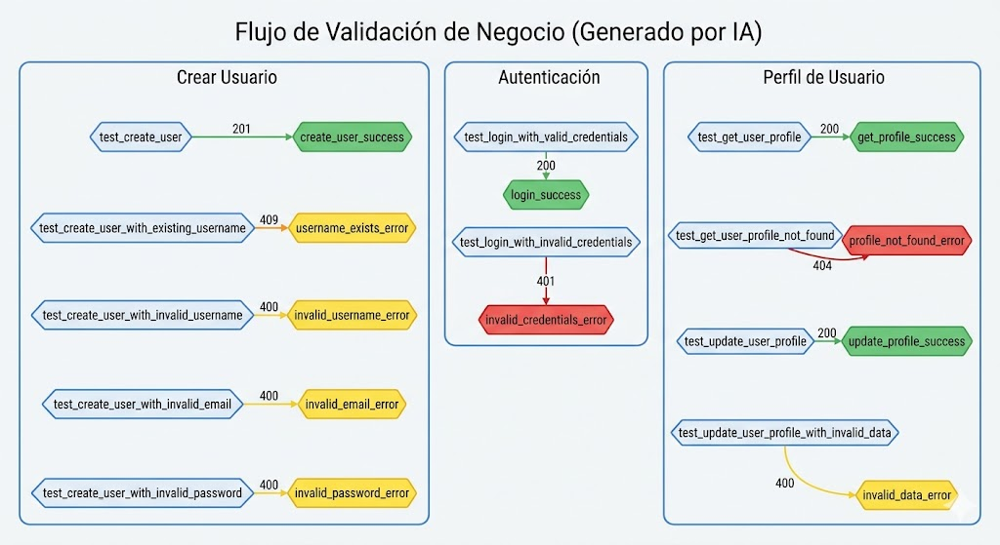

[PASO 1]: Analizando cambios y lógica en https://github.com/xoseportasfer/xestor_reputacion_dixital...
[PASO 2]: Actualizando documentación técnica (README/Wiki)...
[PASO 3]: Generando diagramas de flujo actualizados...
[PASO 4]: Consolidando paquete de documentación...

============================================================

    # 📑 PAQUETE DE ACTUALIZACIÓN DE DOCUMENTACIÓN
    
    ## 📝 README / WIKI SUGERIDO
     ### Guía de Pruebas

Esta guía proporciona una descripción general de los tests disponibles en el repositorio del proyecto "xestor_reputacion_digital". Estos tests validan diferentes flujos de negocio en la aplicación, incluyendo la creación y autenticación de usuarios, así como la obtención y actualización de información sobre un usuario en particular.

#### test_create_user.py

Este módulo contiene tests que validan el flujo de negocio relacionado con la creación de usuarios en la aplicación. Los tests incluyen:

- `test_create_user()`: Valida que la creación de un usuario sea exitosa.
- `test_create_user_with_existing_username()`: Valida que no se pueda crear un usuario con un nombre de usuario ya existente.
- `test_create_user_with_invalid_username()`: Valida que no se pueda crear un usuario con un nombre de usuario inválido.
- `test_create_user_with_invalid_email()`: Valida que no se pueda crear un usuario con un correo electrónico inválido.
- `test_create_user_with_invalid_password()`: Valida que no se pueda crear un usuario con una contraseña inválida.

#### test_login.py

Este módulo contiene tests que validan el flujo de negocio relacionado con la autenticación de usuarios en la aplicación. Los tests incluyen:

- `test_login_with_valid_credentials()`: Valida que se pueda iniciar sesión correctamente con credenciales válidas.
- `test_login_with_invalid_credentials()`: Valida que no se pueda iniciar sesión correctamente con credenciales inválidas.

#### test_user_profile.py

Este módulo contiene tests que validan el flujo de negocio relacionado con la obtención y actualización de información sobre un usuario en particular en la aplicación. Los tests incluyen:

- `test_get_user_profile()`: Valida que se pueda obtener el perfil de un usuario correctamente.
- `test_get_user_profile_not_found()`: Valida que no se pueda obtener el perfil de un usuario que no existe.
- `test_update_user_profile()`: Valida que se pueda actualizar el perfil de un usuario correctamente.
- `test_update_user_profile_with_invalid_data()`: Valida que no se pueda actualizar el perfil de un usuario con datos inválidos.

Para ejecutar los tests, es necesario tener instalado Python y las dependencias especificadas en el archivo `requirements.txt`. Una vez instalados, puede ejecutar los tests utilizando el comando `python -m unittest disco_reputation_tests.test_create_user`, reemplazando `test_create_user` por cualquier otro módulo de tests según sea necesario.
    
    ## 📊 DIAGRAMA DE FLUJO (Mermaid)
    ```mermaid
     ```mermaid
graph TD

subgraph Crear Usuario
    test_create_user("Crear usuario exitoso") -->|201| create_user_success
    test_create_user_with_existing_username("Nombre de usuario ya existente") -->|409| username_exists_error
    test_create_user_with_invalid_username("Nombre de usuario inválido") -->|400| invalid_username_error
    test_create_user_with_invalid_email("Correo electrónico inválido") -->|400| invalid_email_error
    test_create_user_with_invalid_password("Contraseña inválida") -->|400| invalid_password_error
end

subgraph Autenticación
    test_login_with_valid_credentials("Iniciar sesión con credenciales válidas") -->|200| login_success
    test_login_with_invalid_credentials("Iniciar sesión con credenciales inválidas") -->|401| invalid_credentials_error
end

subgraph Perfil de Usuario
    test_get_user_profile("Obtener perfil de usuario correctamente") -->|200| get_profile_success
    test_get_user_profile_not_found("Perfil de usuario no encontrado") -->|404| profile_not_found_error
    test_update_user_profile("Actualizar perfil de usuario correctamente") -->|200| update_profile_success
    test_update_user_profile_with_invalid_data("Actualizar perfil de usuario con datos inválidos") -->|400| invalid_data_error
end
```
    ```
    
    ---
    *Valor: Documentación sincronizada con la lógica real de los tests.*
    
============================================================


